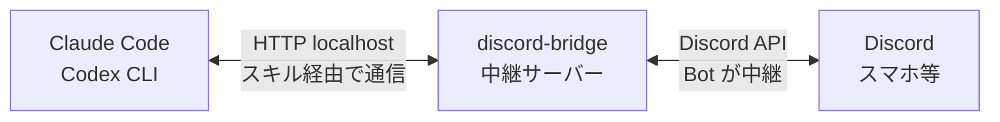

# discord-bridge

Claude Code / Codex CLI を Discord 経由で操作するための中継サーバーと、エージェント用スキルを提供します。

> [!WARNING]
> 作者は **Claude Code** を使っており、 **Codex CLI** での動作確認は行っていません  
> Codexでも利用できるようにSkillsを構成したつもりですが、README通り設定してもうまく動かないかもです  
> もしCodexをお使いの方で動かせた場合は、苦労した点などご報告いただけると幸いです


## 対象

- Claude Code や Codex CLI を **Discord を介してリモート操作**したい人
- [OpenClaw](https://github.com/openclaw/openclaw) ほど大がかりな仕組みは不要で、**シンプルに Discord から指示を出せればいい**人
- 外出先のスマホから作業指示を出したい人

## できること

ターミナルで Claude Code / Codex を起動し、Discord の専用チャンネルを通じて Bot 経由で双方向にやりとりできます。

**Discord → エージェント（あなたからの操作）**

- **作業指示** - Discord にメッセージを送るだけでエージェントに指示を出せる
- **質問への回答** - エージェントからの確認にリアルタイムで回答
- **離席モード終了** - 「戻ったよ」と送って通常のターミナル操作に戻る

**エージェント → Discord（エージェントからの連絡）**

- **進捗通知** - 処理の進捗・成功・エラーを Discord に通知
- **質問** - 判断が必要な場面で選択肢付きの質問を送信
- **ファイル送信** - スクリーンショットやログを Discord に共有



## 注意事項

ターミナル上に表示される権限確認は Discord から許可できないので、自動実行モードでの起動を前提としています。
エージェントがファイル編集やコマンド実行を確認なしで行うことを意味します。
各 AI エージェントの注意事項をよく読み、自己責任で実行してください。

> **※ よく分からない場合は実行しないでください。**

```bash
# Claude Code
claude --dangerously-skip-permissions

# Codex CLI
codex --full-auto
```

## 事前準備

以下はブラウザや Discord アプリでの操作が必要なため、あらかじめ手動で済ませておいてください。

### 1. Discord Bot 作成

1. [Discord Developer Portal](https://discord.com/developers/applications) にアクセス
2. "New Application" をクリック → 名前を入力して作成
3. 左メニュー "Bot" → "Reset Token" → トークンをコピー
4. "Privileged Gateway Intents" で **MESSAGE CONTENT INTENT** を有効化
5. 左メニュー "OAuth2" → "URL Generator"
   - Scopes: `bot`
   - Bot Permissions: `Send Messages`, `Read Message History`, `Attach Files`, `Embed Links`
6. 生成された URL を開いて Bot をサーバーに追加

### 2. ID の取得

Discord の設定 → 詳細設定 → **開発者モード** を有効化してから:

- **チャンネル ID**: チャンネル名を右クリック → "チャンネル ID をコピー"
- **ユーザー ID**: 自分の名前を右クリック → "ユーザー ID をコピー"
  - Bot に指示を出すユーザー（自分自身）の ID です。Bot があなたからのメッセージだけを処理するために使います

## セットアップ

セットアップしたいプロジェクトフォルダで Claude Code / Codex CLI を起動し、このページのURLを渡してセットアップを依頼してください。
指示に従えばセットアップ完了＆動作確認までいけると思います。

以下は手動で行う場合の手順です。

### 1. インストール

```bash
npm install -g discord-bridge
```

アップデートする場合も同じコマンドです:

```bash
npm update -g discord-bridge
```

### 2. 環境変数の設定

`~/.zshrc` に追加:

```bash
export DISCORD_BRIDGE_TOKEN="your_bot_token_here"
```

設定後、`source ~/.zshrc` で反映してください（新しいターミナルを開く場合は不要です）。

### 3. プロジェクト設定

Claude Code / Codex CLI を使うプロジェクトのルートに `.discord-bridge.json` を作成:

```json
{
  "channelId": "your_channel_id_here",
  "allowedUserIds": ["your_user_id_here"]
}
```

`allowedUserIds` に複数のユーザー ID を指定すると、全員の発言に応答します。1人目のユーザーが質問通知（`/ask`）のメンション対象になります。

> **Note**: `channelId` と `allowedUserIds` は秘密情報ではありませんが、プロジェクト固有の設定です。チームで共有する場合はそのままコミットし、個人用の場合は `.gitignore` に追加してください。

### 4. スキルのインストール

プラットフォームを指定してインストールします:

```bash
# Claude Code の場合
discord-bridge install claude

# Codex の場合
discord-bridge install codex
```

`--user` を付けるとホームディレクトリにインストールされ、全プロジェクトで利用できます:

```bash
discord-bridge install claude --user
discord-bridge install codex --user
```

| コマンド | インストール先 |
|---|---|
| `install claude` | `.claude/skills/discord-comm/` |
| `install claude --user` | `~/.claude/skills/discord-comm/` |
| `install codex` | `.agents/skills/discord-comm/` |
| `install codex --user` | `~/.agents/skills/discord-comm/` |

インストール後、エージェントを再起動してスキルを読み込みます。

### 5. サーバーの起動

Claude Code / Codex を使うターミナルとは**別のターミナル**を開き、手動で起動しておきます:

```bash
discord-bridge start
```

停止するには `Ctrl + C` を押してください。

ヘルスチェック（任意）:

```bash
discord-bridge status
```

`{"status":"ok","bot":"BotName#1234",...}` が返れば成功です。

## 使い方

`.discord-bridge.json` を配置したプロジェクトフォルダで Claude Code / Codex CLI を起動してください。

### テスト通知

Claude Code / Codex CLI を使っているターミナルで「Discord に通知して」と伝えます。

### 離席モードにする

Claude Code / Codex CLI を使っているターミナルで「離席するよ」と伝えます。
Discord 側に「待機中」のログが流れたら、それ以降は Discord で指示できます。

> 離席モード中はターミナルでの指示はできません。

### 離席モードを解除する

Discord で「戻ったよ」と伝えます。
エージェントがターミナル操作に戻り、通常通り使えるようになります。

## トラブルシューティング

| 症状 | 確認ポイント |
|---|---|
| Bot がオフライン | `DISCORD_BRIDGE_TOKEN` が正しいか |
| メッセージが届かない | MESSAGE CONTENT INTENT が有効か |
| チャンネルが見つからない | `.discord-bridge.json` の `channelId` が正しいか |
| 返答が受信されない | `.discord-bridge.json` の `allowedUserIds` が正しいか |

## ライセンス

MIT
